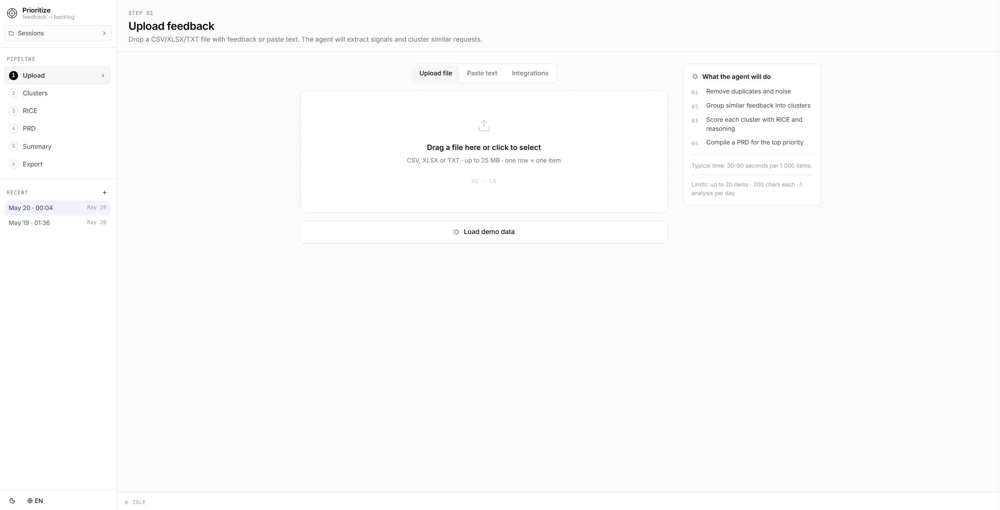
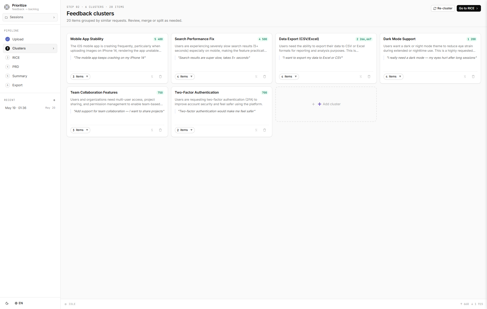
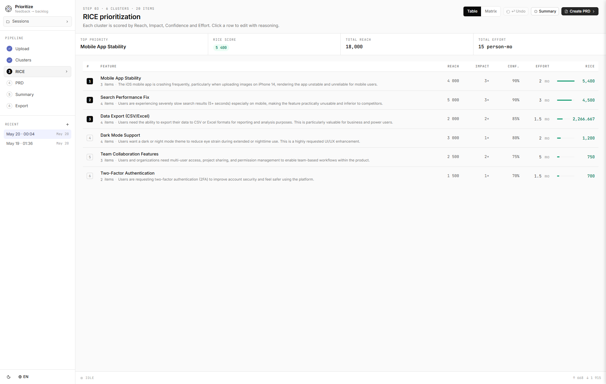
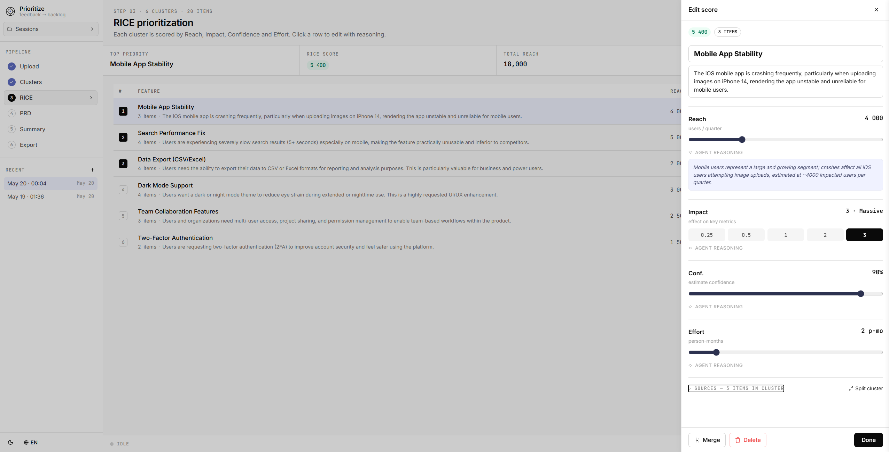
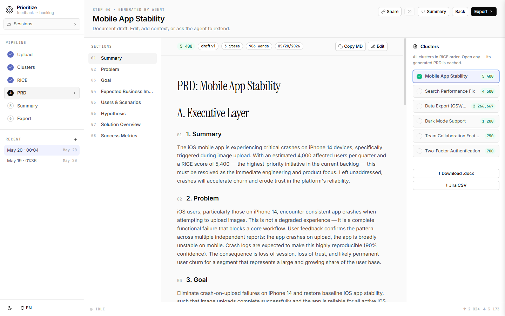
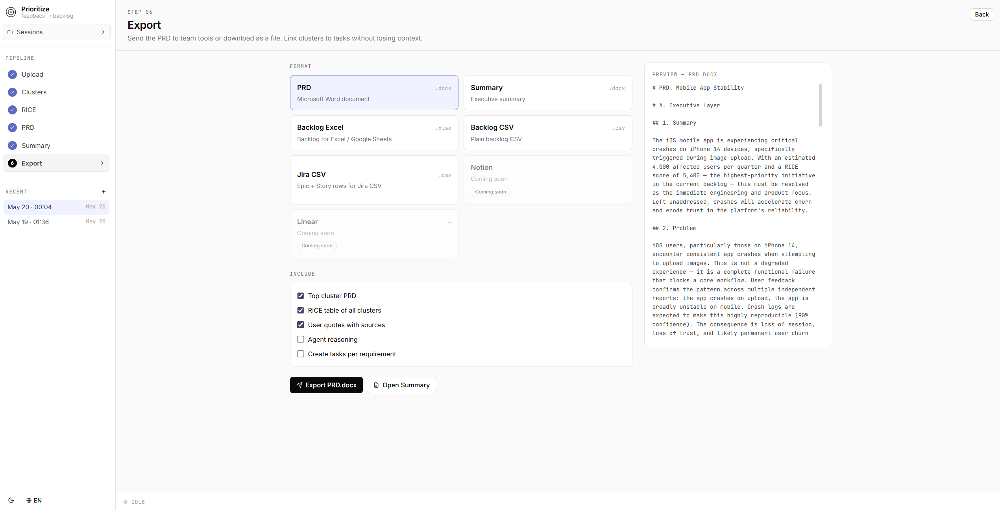

# Feature Prioritization Agent

An AI-native product management tool that transforms raw user feedback into a prioritized feature backlog, RICE-scored clusters, and a ready-to-share PRD — all in a few minutes.

Built with **Claude** (Anthropic), **FastAPI**, and **React + TypeScript**.

---

## What it does

1. **Ingest feedback** — paste text items or upload a CSV / TXT file
2. **Cluster & score** — Claude groups feedback into 3–8 thematic clusters and assigns RICE scores (Reach × Impact × Confidence / Effort) with reasoning
3. **Prioritize** — interactive RICE table lets you tweak scores and see live ranking
4. **Generate PRD** — one-click PRD for any cluster, streamed in real time, editable in-browser
5. **Executive Summary** — one-page stakeholder brief generated from the full backlog
6. **Export** — download as CSV, Excel, DOCX, or Jira-import CSV; share a read-only link

---

## Demo

**Upload feedback** — drag-and-drop a CSV/XLSX/TXT file or paste text; the agent explains what it will do before starting:



**Feedback clusters** — Claude groups raw feedback into 3–8 thematic clusters with representative quotes:



**RICE prioritization** — each cluster is scored by Reach × Impact × Confidence / Effort with full reasoning:



**Cluster details & score editing** — click any row to open a sidebar with the full cluster rationale and sliders to adjust individual RICE parameters:



**PRD generation** — one-click PRD streamed in real time, editable in-browser, exportable to DOCX:



**Export** — download the PRD as DOCX, backlog as Excel/CSV, or push tasks to Jira; configure exactly what content to include:



---

## Tech stack

| Layer | Technology |
|---|---|
| AI | Claude Sonnet via [Anthropic SDK](https://github.com/anthropics/anthropic-sdk-python) |
| Backend | Python 3.11 · FastAPI · uvicorn · slowapi (rate limiting) |
| Frontend | React 18 · TypeScript · Vite 5 · Tailwind CSS 3 · Zustand |
| Streaming | Server-Sent Events (SSE) |
| Storage | JSON file session cache · Redis (optional, for rate-limit persistence) |
| Deploy | Docker + docker-compose · nginx |

---

## Prerequisites

- [Docker](https://docs.docker.com/get-docker/) and [Docker Compose](https://docs.docker.com/compose/install/) **or** Python 3.11+ and Node 20+
- An [Anthropic API key](https://console.anthropic.com/)

---

## Quick start (Docker)

```bash
# 1. Clone the repo
git clone https://github.com/your-username/feature-prioritization.git
cd feature-prioritization
```

```bash
# 2. Create .env from the example
# Mac / Linux / Git Bash:
cp .env.example .env
# Windows PowerShell:
# Copy-Item .env.example .env
```

Open `.env` and set `ANTHROPIC_API_KEY=sk-ant-...`

```bash
# 3. Build and run
docker compose up --build
```

Open **http://localhost** in your browser.

> **Port 80 in use?** Set `FRONTEND_PORT=8080` in `.env` and open `http://localhost:8080` instead.

---

## Manual setup (without Docker)

### Backend

```bash
cd backend

# Create a virtual environment
# Mac / Linux:
python3 -m venv .venv && source .venv/bin/activate
# Windows PowerShell:
# python -m venv .venv; .venv\Scripts\Activate.ps1

# Install dependencies
pip install -r requirements.txt
```

Create a `.env` file at the **project root** (one level above `backend/`).
The easiest way is to copy the example and fill in your key:

```bash
# Mac / Linux / Git Bash:
cp .env.example .env
# Windows PowerShell:
# Copy-Item .env.example .env
```

Then open `.env` and set `ANTHROPIC_API_KEY=sk-ant-...`

```bash
# Start the server (from the backend/ directory)
uvicorn main:app --reload --port 8000
```

### Frontend

```bash
cd frontend
npm install
npm run dev
```

Open **http://localhost:5173**.

> The Vite dev server proxies `/api/*` to `http://localhost:8000` automatically.

---

## Environment variables

| Variable | Required | Default | Description |
|---|---|---|---|
| `ANTHROPIC_API_KEY` | **yes** | — | Your Anthropic API key |
| `ALLOWED_ORIGINS` | no | `http://localhost:5173,http://localhost:3000` | Comma-separated CORS origins |
| `TRUST_PROXY` | no | — | Set to `1` when behind a reverse proxy (nginx, Cloudflare) to honour `X-Forwarded-For` for rate limiting |
| `REDIS_URL` | no | in-memory | Redis connection string for persistent rate-limit storage, e.g. `redis://redis:6379` |
| `SESSION_CACHE_PATH` | no | `backend/.session_cache.json` | Path where sessions are written; useful for Docker volume mounts |
| `FRONTEND_PORT` | no | `80` | Host port for the nginx container |

---

## Rate limits

The `/api/cluster` endpoint is limited to **1 analysis per IP per day** to control API costs.

Running locally and want to remove the limit? In `backend/main.py`, change:

```python
@limiter.limit("1/day")
```

to:

```python
@limiter.limit("100/day")
```

---

## Project structure

```
feature-prioritization/
├── backend/
│   ├── main.py              # FastAPI routes
│   ├── claude_client.py     # Prompt logic & Anthropic SDK calls
│   ├── session_manager.py   # JSON-based session persistence
│   ├── docx_export.py       # DOCX generation
│   ├── requirements.txt
│   └── Dockerfile
├── frontend/
│   ├── src/
│   │   ├── components/      # React components (screens, UI primitives)
│   │   ├── store.ts         # Zustand global state
│   │   ├── api.ts           # Typed API client
│   │   ├── i18n.ts          # EN / RU translations
│   │   └── types.ts         # Shared TypeScript types
│   ├── nginx.conf
│   └── Dockerfile
├── docker-compose.yml
├── .env.example
└── DEPLOY.md                # Production deployment notes
```

---

## Supported languages

English and Russian. The language toggle on the upload screen switches both the UI and the AI-generated content.

---

## License

MIT
